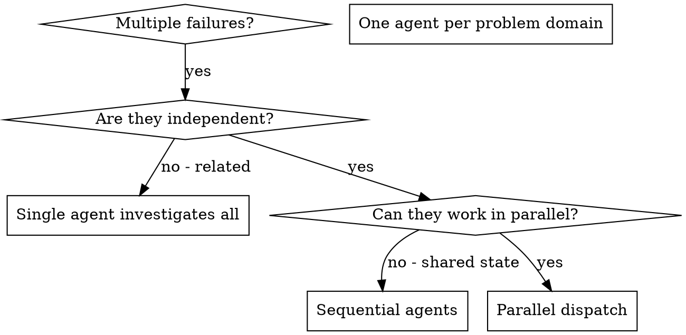

# Dispatching Parallel Agents

## Overview

You delegate tasks to specialized agents with isolated context. By precisely crafting their instructions and context, you ensure they stay focused and succeed at their task. They should never inherit your session's context or history — you construct exactly what they need. This also preserves your own context for coordination work.

When you have multiple unrelated failures (different test files, different subsystems, different bugs), investigating them sequentially wastes time. Each investigation is independent and can happen in parallel.

**Core principle:** Dispatch one read-only investigation agent per independent problem domain. They diagnose in parallel and report back; the controller applies fixes serially. Never dispatch two file-modifying agents concurrently.

## When to Use



**Use when:**
- 3+ test files failing with different root causes
- Multiple subsystems broken independently
- Each problem can be understood without context from others
- No shared state between investigations

**Don't use when:**
- Failures are related (fix one might fix others)
- Need to understand full system state
- Agents would interfere with each other

## The Pattern

**Read-only only.** Agents dispatched in parallel must not modify files — they investigate and return a diagnosis + recommended fix. The controller (or a serial follow-up agent) applies the actual changes one at a time, so two writers never race on the same files.

### 1. Identify Independent Domains

Group failures by what's broken:
- File A tests: Tool approval flow
- File B tests: Batch completion behavior
- File C tests: Abort functionality

Each domain is independent - fixing tool approval doesn't affect abort tests.

### 2. Create Focused Agent Tasks

Each agent gets:
- **Specific scope:** One test file or subsystem
- **Clear goal:** Diagnose the root cause and recommend a fix
- **Constraints:** Read-only — do not modify files; report findings only.
- **Expected output:** Summary of root cause + recommended fix

### 3. Dispatch in Parallel

Issue all three subagent dispatches in the same response — they run in parallel:

```text
Subagent (general-purpose): "Investigate agent-tool-abort.test.ts failures and report root cause + recommended fix (read-only)"
Subagent (general-purpose): "Investigate batch-completion-behavior.test.ts failures and report root cause + recommended fix (read-only)"
Subagent (general-purpose): "Investigate tool-approval-race-conditions.test.ts failures and report root cause + recommended fix (read-only)"
# All three run concurrently.
```

Multiple dispatch calls in one response = parallel execution. One per response = sequential.

### 4. Apply Fixes and Verify

When agents return:
- Read each diagnosis
- Apply the recommended fixes one at a time
- Run focused tests for each change; the human runs the full suite.
- Verify fixes don't conflict

## Agent Prompt Structure

Good agent prompts are:
1. **Focused** - One clear problem domain
2. **Self-contained** - All context needed to understand the problem
3. **Specific about output** - What should the agent return?

```markdown
Investigate the 3 failing tests in src/agents/agent-tool-abort.test.ts and report root cause + recommended fix (read-only — do not modify files):

1. "should abort tool with partial output capture" - expects 'interrupted at' in message
2. "should handle mixed completed and aborted tools" - fast tool aborted instead of completed
3. "should properly track pendingToolCount" - expects 3 results but gets 0

These are timing/race condition issues. Your task:

1. Read the test file and understand what each test verifies
2. Identify root cause - timing issues or actual bugs?
3. Report your diagnosis and recommended fix. Do NOT just say "increase timeouts" — find the real issue.

Return: Summary of root cause and recommended fix. Do NOT modify any files.
```

## Common Mistakes

**❌ Letting a parallel agent edit files — parallel writers race. ✅ Parallel agents are read-only; fixes are applied serially.**

**❌ Too broad:** "Fix all the tests" - agent gets lost
**✅ Specific:** "Fix agent-tool-abort.test.ts" - focused scope

**❌ No context:** "Fix the race condition" - agent doesn't know where
**✅ Context:** Paste the error messages and test names

**❌ No constraints:** Agent might refactor everything
**✅ Constraints:** "Do NOT change production code" or "Fix tests only"

**❌ Vague output:** "Fix it" - you don't know what changed
**✅ Specific:** "Return summary of root cause and changes"

## When NOT to Use

**Related failures:** Fixing one might fix others - investigate together first
**Need full context:** Understanding requires seeing entire system
**Exploratory debugging:** You don't know what's broken yet
**Shared state:** Agents would interfere (editing same files, using same resources)

## Real Example from Session

**Scenario:** 6 test failures across 3 files after major refactoring

**Failures:**
- agent-tool-abort.test.ts: 3 failures (timing issues)
- batch-completion-behavior.test.ts: 2 failures (tools not executing)
- tool-approval-race-conditions.test.ts: 1 failure (execution count = 0)

**Decision:** Independent domains - abort logic separate from batch completion separate from race conditions

**Dispatch:**
```
Agent 1 → Fix agent-tool-abort.test.ts
Agent 2 → Fix batch-completion-behavior.test.ts
Agent 3 → Fix tool-approval-race-conditions.test.ts
```

**Investigation results:**
- Agent 1: Diagnosed timing issues — recommended event-based waiting
- Agent 2: Diagnosed event structure bug (threadId in wrong place) — recommended fix
- Agent 3: Diagnosed missing async wait — recommended fix

**Integration:** 3 agents investigated in parallel; controller applied each fix serially and ran focused tests

**Time saved:** 3 problems solved in parallel vs sequentially

## Key Benefits

1. **Parallelization** - Multiple investigations happen simultaneously
2. **Focus** - Each agent has narrow scope, less context to track
3. **Independence** - Agents don't interfere with each other
4. **Speed** - 3 problems solved in time of 1

## Verification

After agents return:
1. **Review each summary** - Understand what changed
2. **Check for conflicts** - Did agents edit same code?
3. **Run focused tests** - Run focused tests for each integrated fix; the human runs the full suite
4. **Spot check** - Agents can make systematic errors

## Real-World Impact

From debugging session (2025-10-03):
- 6 failures across 3 files
- 3 agents investigated in parallel (read-only)
- All investigations completed concurrently
- Controller applied fixes serially, ran focused tests after each
- Zero conflicts between agent changes
